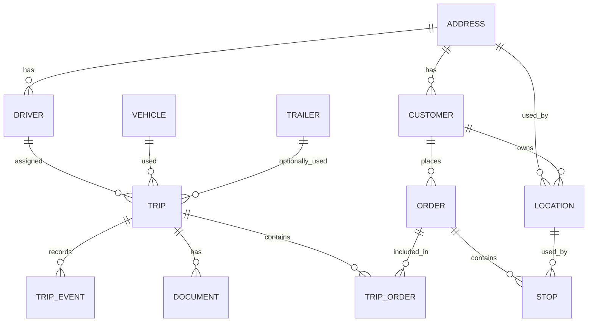

# Domain ERD

```mermaid
erDiagram

    ADDRESS ||--o{ DRIVER : has
    ADDRESS ||--o{ CUSTOMER : has
    ADDRESS ||--o{ LOCATION : used_by

    CUSTOMER ||--o{ LOCATION : owns
    CUSTOMER ||--o{ ORDER : places

    ORDER ||--o{ STOP : contains

    TRIP ||--o{ TRIP_EVENT : records
    TRIP ||--o{ DOCUMENT : has

    DRIVER ||--o{ TRIP : assigned
    VEHICLE ||--o{ TRIP : used
    TRAILER ||--o{ TRIP : optionally_used

    TRIP ||--o{ TRIP_ORDER : contains
    ORDER ||--o{ TRIP_ORDER : included_in

    LOCATION ||--o{ STOP : used_by
```
